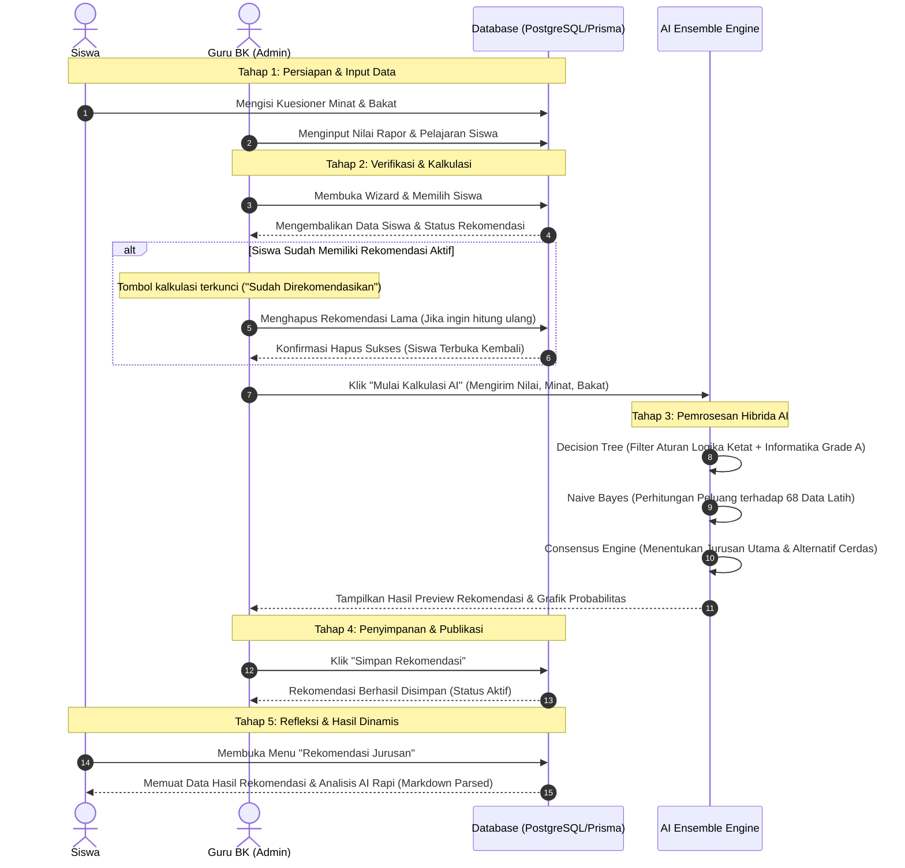

# 🗺️ Alur Proses Rekomendasi Jurusan (End-to-End Workflow)
## Sistem Konseling BK Cerdas - SMP Bina Karya Ngamprah

Dokumen ini menjelaskan alur kerja terintegrasi dari proses rekomendasi jurusan siswa, mulai dari input data awal, kalkulasi hibrida AI oleh Guru BK, penyimpanan data, hingga visualisasi dinamis di dashboard siswa.

---

## 🗺️ Diagram Alur Proses Bisnis (Business Workflow)



---

## 📝 Penjelasan Detail Setiap Tahapan

### Tahap 1: Persiapan & Pengumpulan Data
Sebelum rekomendasi dapat dihasilkan, sistem membutuhkan dua pilar data utama dari siswa:
1.  **Data Akademis (Nilai Rapor)**: Guru BK atau sistem menginput nilai rata-rata mata pelajaran penunjang:
    *   **STEM**: Matematika, IPA, Informatika (Informatika memiliki filter khusus).
    *   **Sosial**: IPS, PKN.
    *   **Bahasa**: Bahasa Indonesia, Bahasa Inggris.
2.  **Data Psikologis (Minat & Bakat)**: Siswa mengisi kuesioner minat dominan (7 bidang minat standar) dan menuliskan deskripsi bebas mengenai bakat praktis yang mereka sukai (misalnya: *"Saya suka mendesain gambar dan mengedit video"*).

### Tahap 2: Verifikasi & Aturan Anti-Duplikasi
Untuk menjaga konsistensi data dan mencegah konflik penyimpanan, sistem menerapkan aturan validasi ketat:
*   **Aturan Kunci**: Satu siswa hanya boleh memiliki **satu data rekomendasi aktif** di database.
*   **Logika Antarmuka (UI/UX)**:
    *   Jika database mendeteksi siswa sudah direkomendasikan, tombol kalkulasi pada baris siswa tersebut akan dinonaktifkan dan bertuliskan **"Sudah Direkomendasikan"**.
    *   Jika ingin menghitung ulang (karena perubahan nilai atau kuesioner baru), Guru BK harus masuk ke daftar rekomendasi, mengklik ikon **Hapus (`Trash2`)**, lalu menyetujui modal konfirmasi hapus. Setelah terhapus, siswa tersebut akan terbuka kembali di wizard pembuatan.

### Tahap 3: Pemrosesan AI Ensemble (Hibrida)
Ketika tombol *"Mulai Kalkulasi AI"* diklik, data dikirim ke server untuk diproses secara instan melalui sistem konsensus hibrida:
1.  **Decision Tree (Logika Aturan)**:
    *   Menyaring secara hierarkis (Minat $\rightarrow$ Bakat $\rightarrow$ Nilai).
    *   Menerapkan aturan *Informatika Grade A*: Jika nilai Informatika $\ge 82$, siswa secara otomatis diarahkan ke rumpun IT terapan (RPL atau TKJ).
2.  **Naive Bayes (Distribusi Probabilitas)**:
    *   Menghitung kecocokan persentase terhadap **68 sampel data latih** (`TRAINING_SAMPLES`).
    *   Melakukan pencocokan teks bakat secara cerdas (*Case-Insensitive Substring Match*).
    *   Menerapkan *Laplace Smoothing* untuk mencegah nilai probabilitas nol.
3.  **Consensus Engine (Konsensus)**:
    *   **Rekomendasi Utama**: Mengambil kesepakatan kedua algoritma. Jika berbeda, memprioritaskan Decision Tree dengan menurunkan tingkat keyakinan (*confidence rate*) sebagai wujud transparansi.
    *   **Rekomendasi Alternatif**: Diambil secara dinamis dari peringkat terbaik Naive Bayes yang **dijamin berbeda** dari rekomendasi utama.

### Tahap 4: Peninjauan & Penyimpanan Guru BK
*   Hasil kalkulasi ditampilkan dalam bentuk panel pratinjau (*preview*) interaktif.
*   Guru BK meninjau kecocokan hasil prediksi AI dengan kondisi nyata siswa.
*   Ketika tombol **"Simpan Rekomendasi"** diklik, sistem menyimpan objek ke tabel `RekomendasiJurusan` di database PostgreSQL. 
*   Persentase probabilitas seluruh 17 kelas disimpan dalam bentuk **JSON** pada kolom `detail_persentase` untuk auditability di masa mendatang.

### Tahap 5: Visualisasi Dinamis di Dashboard Siswa
Setelah disimpan oleh Guru BK, siswa dapat langsung melihat hasilnya secara dinamis:
1.  **Akses Mandiri**: Siswa membuka menu *"Rekomendasi Jurusan"* di dashboard mereka.
2.  **Tampilan Premium**: Hasil dimuat langsung secara *real-time* dari database:
    *   **Jurusan Utama** ditampilkan dengan kartu bernuansa biru menyala.
    *   **Jurusan Alternatif** ditampilkan dengan kartu kontras bernuansa gradasi oranye-amber yang mewah.
    *   **Pemberian Highlight Teks**: Tanda bintang markdown (`**`) pada dasar keputusan AI diparsing secara otomatis menjadi elemen visual yang indah (teks tebal dengan latar belakang pil pastel biru lembut).

---

## 🗄️ Struktur Penyimpanan Database (Prisma Schema Mapping)

Berikut adalah bagaimana data rekomendasi dipetakan dan dihubungkan di dalam database PostgreSQL menggunakan ORM Prisma:

```prisma
model RekomendasiJurusan {
  id                 String   @id @default(uuid())
  siswaId            String   @unique // Menjamin aturan 1 siswa = 1 rekomendasi
  siswa              Siswa    @relation(fields: [siswaId], references: [id], onDelete: Cascade)
  rekomendasi_akhir  String   // Jurusan Utama (Hasil Konsensus AI)
  jurusan_alternatif String   // Jurusan Cadangan (Peringkat 2 Naive Bayes)
  detail_presentase  Json     // Menyimpan detail matematis Decision Tree & Naive Bayes lengkap
  createdAt          DateTime @default(now())
  updatedAt          DateTime @updatedAt
}
```

---

## 💎 Manfaat Alur Kerja Terintegrasi Ini
*   **Keamanan Konsistensi Data**: Menghilangkan risiko data ganda (*duplicate entries*).
*   **Transparansi Konseling**: Guru BK memiliki dasar ilmiah tertulis (persentase Naive Bayes & aturan pohon keputusan) saat berdiskusi dengan orang tua siswa.
*   **Responsif & Real-time**: Perubahan keputusan Guru BK di admin langsung ter-update seketika di layar gawai (smartphone/laptop) siswa.
*   **User Experience (UX) Kelas Atas**: Visualisasi data yang rapi dan elegan memberikan kenyamanan psikologis bagi siswa yang sedang menentukan masa depannya.
