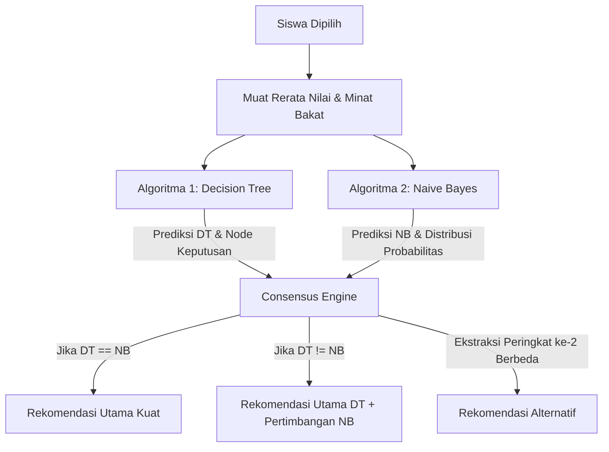

# 🧠 Cara Kerja Sistem Klasifikasi AI Rekomendasi Penjurusan
## (Hibrida: Decision Tree & Naive Bayes dengan Sistem Konsensus)

Sistem rekomendasi jurusan pada aplikasi Konseling BK ini menggunakan pendekatan **Hibrida AI (Ensemble)** yang menggabungkan dua algoritma klasifikasi populer: **Decision Tree (Pohon Keputusan)** dan **Naive Bayes (Klasifikasi Probabilitas)**. 

Kedua algoritma ini bekerja sama untuk menghasilkan rekomendasi yang akurat, transparan, dan dapat dipertanggungjawabkan secara akademis maupun minat-bakat psikologis.

---

## 🗺️ Gambaran Umum Alur Klasifikasi

---

## 🌳 1. Algoritma Decision Tree (Pohon Keputusan)

### Analogi Sederhana: "Filter Bertingkat"
Bayangkan sebuah saringan air bertingkat. Air mengalir dari atas, melewati saringan pertama (Minat), kemudian saringan kedua (Bakat), dan saringan terakhir (Nilai). Jurusan yang keluar di bagian paling bawah adalah rekomendasi akhir.

### Cara Kerja di Sistem:
Decision Tree membagi data siswa secara ketat menggunakan aturan logika IF-THEN (Cabang Keputusan) berdasarkan prioritas psikologi penjurusan di Indonesia.

1.  **Cabang Tingkat 1: Minat Utama** (Cabang Terkuat)
    *   Jika minat siswa adalah **"Sains & Teknologi"**, ia diarahkan ke rumpun Sains.
    *   Jika minat siswa adalah **"Bisnis & Manajemen"**, ia diarahkan ke rumpun Bisnis/Kantor.
    *   Sistem memetakan seluruh 7 minat utama secara terstruktur.
2.  **Cabang Tingkat 2: Bakat Dominan**
    *   Setelah minat dipetakan, bakat dominan digunakan untuk mempersempit pilihan. 
    *   Misal: Minat **"Sains & Teknologi"** + Bakat **"Pemrograman"** $\rightarrow$ Diarahkan langsung ke **SMK RPL**.
    *   Minat **"Sains & Teknologi"** + Bakat **"Jaringan"** $\rightarrow$ Diarahkan ke **SMK TKJ**.
3.  **Cabang Tingkat 3: Evaluasi Nilai Akademik & Aturan Khusus**
    *   Model pohon keputusan mengevaluasi rata-rata bidang nilai penunjang untuk memastikan siswa mampu mengikuti materi pelajaran.
    *   **Fitur Informatika Khusus (Informatika Grade A)**: Jika siswa berminat di teknologi dan nilai Informatika-nya $\ge 82$, sistem secara khusus langsung mengunci rekomendasi ke arah bidang IT (**SMK RPL** atau **SMK TKJ**), mencegah siswa tersebut "terlempar" ke rumpun umum seperti MIPA.

---

## 📊 2. Algoritma Naive Bayes (Klasifikasi Probabilitas)

### Analogi Sederhana: "Detektif Pencocok Pola"
Bayangkan seorang detektif yang memiliki buku sejarah berisi profil ratusan siswa yang sukses di berbagai jurusan. Saat ada siswa baru masuk, detektif membandingkan kemiripan profil siswa baru tersebut dengan semua kelompok siswa di buku sejarahnya, lalu menghitung persentase kemiripannya.

### Cara Kerja Perhitungan Matematis:

Naive Bayes bekerja menggunakan teori peluang Bayes dengan rumus:

$$P(C | A) = \frac{P(A | C) \times P(C)}{P(A)}$$

Di mana:
*   $C$ adalah Kelas Jurusan (misal: *SMK RPL*, *SMA MIPA*).
*   $A$ adalah Atribut Siswa (nilai STEM, Sosial, Bahasa, Minat, Bakat).

Sistem melakukan perhitungan dalam 4 tahapan:
1.  **Peluang Awal (Prior Probability - $P(C)$)**:
    Menghitung peluang awal masing-masing jurusan berdasarkan proporsi jumlah data latih (`TRAINING_SAMPLES`) di dalam database.
2.  **Peluang Karakteristik (Likelihood - $P(A|C)$)**:
    Menghitung seberapa sering karakteristik seperti siswa baru muncul di setiap jurusan pada data sejarah.
    *   *Laplace Smoothing*: Jika ada karakteristik siswa baru yang sama sekali tidak ada di sejarah suatu jurusan, secara matematis nilai kecocokannya akan menjadi `0`. Agar tidak merusak perkalian keseluruhan, ditambahkan nilai $+1$ (Smoothing) pada setiap hitungan peluang agar tetap memiliki peluang kecil.
    *   *Natural Language Substring Matching*: Pencocokan bakat dibuat sangat fleksibel dan tidak kaku (Case-Insensitive Substring). Kata kunci alami seperti *"mengetik"*, *"koding"*, *"gambar"* dapat langsung dicocokkan dengan kalimat panjang pada data latih seperti *"Administrasi Perkantoran Mengetik Surat"*.
3.  **Penggabungan Skor (Posterior - $P(C|A)$)**:
    Mengalikan Peluang Awal dengan seluruh Peluang Karakteristik untuk masing-masing jurusan.
4.  **Normalisasi Ke Persentase (Confidence)**:
    Semua skor akhir dari 17 jurusan dibandingkan, dijumlahkan, lalu diubah menjadi persentase skala 0-100% untuk menentukan tingkat keyakinan AI.

---

## 🤝 3. Sistem Konsensus Hibrida & Rekomendasi Alternatif

Untuk memberikan hasil terbaik, kedua algoritma di atas digabungkan menjadi satu kesatuan mesin pengambil keputusan (Ensemble Engine):

### A. Penentuan Rekomendasi Utama (Consensus)
*   **Jika Decision Tree dan Naive Bayes Sepakat**:
    Rekomendasi utama dikeluarkan dengan tingkat keyakinan (Confidence) yang tinggi.
*   **Jika Terjadi Perbedaan Pendapat**:
    Sistem akan memprioritaskan rekomendasi dari **Decision Tree** karena pohon keputusan dirancang mengikuti panduan psikologis minat-bakat terstruktur secara ketat. Namun, tingkat keyakinan (Confidence) diturunkan menjadi rata-rata dari kedua algoritma sebagai indikator transparansi bahwa ada variasi pilihan.

### B. Penentuan Rekomendasi Alternatif (Peringkat ke-2)
Sistem secara cerdas merumuskan opsi cadangan untuk memberikan alternatif jalan masa depan kepada siswa:
1.  Sistem melihat urutan persentase probabilitas hasil Naive Bayes dari peringkat tertinggi ke terendah.
2.  Sistem memeriksa: **Apakah peringkat 1 Naive Bayes sama dengan Rekomendasi Utama?**
    *   Jika **Berbeda**: Maka peringkat 1 Naive Bayes tersebut langsung dijadikan **Rekomendasi Alternatif**.
    *   Jika **Sama**: Sistem secara dinamis mengambil **peringkat ke-2** dari Naive Bayes sebagai **Rekomendasi Alternatif**.
3.  Metode ini menjamin bahwa rekomendasi alternatif yang ditawarkan kepada siswa **selalu rasional, ilmiah, dan dijamin berbeda** dari rekomendasi utama.

---

## 💎 Kesimpulan Keunggulan Sistem Hibrida Ini
*   **Logis & Ilmiah**: Menggabungkan aturan logika biner psikolog BK (Decision Tree) dengan distribusi statistik matematis riil (Naive Bayes).
*   **Akurat terhadap Minat Riil**: Mampu menangkap potensi IT anak secara akurat dengan rule Informatika khusus.
*   **Toleran Terhadap Bahasa Alami**: Tidak kaku terhadap input bakat guru BK karena fitur pencocokan substring kata kunci.
*   **Multi-Opsi**: Selalu memberikan pilihan cadangan ilmiah (Rekomendasi Alternatif) yang berbeda untuk bahan diskusi konseling yang lebih kaya.
